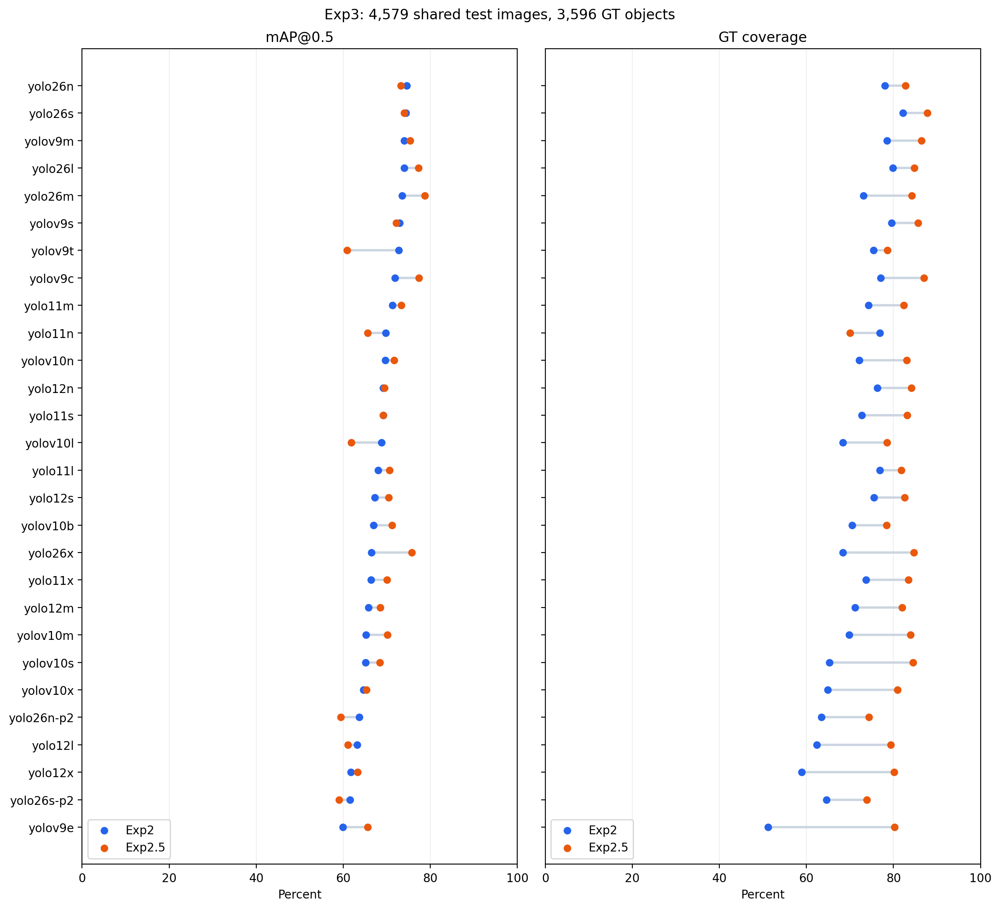

# Experiment 3 results

**Completed: 56/56 checkpoints on Rainbow, September 11, 2026.** All models used the same 4,579 test images,
including 3,180 backgrounds, and the same 3,596 original GT object UUIDs. Each model's mAP@0.5 and GT coverage were
computed from one validation pass. All checkpoint hashes and the final UUID accounting passed verification.

- Highest GT coverage: **Exp2.5 YOLO26s, 87.792%** — 3,157 detected, 439 missed, 2,553 extra boxes; mAP@0.5 **73.990%**.
- Highest mAP@0.5: **Exp2.5 YOLO26m, 78.703%** — GT coverage **84.232%**, 3,029 detected, 567 missed, 1,840 extra boxes.
- Exp2.5 had higher GT coverage for **27/28** corresponding architectures and higher mAP@0.5 for **18/28**.
  It also produced more extra boxes for **27/28** architectures.

The following are unweighted means across the 28 architectures in each training group. They describe this checkpoint
collection and test set; they are not an ensemble evaluation or an estimate of statistical significance.

| Training          | Mean mAP@0.5 (%) | Mean GT detected (%) | Mean extra boxes per model |
| ----------------- | ---------------: | -------------------: | -------------------------: |
| Exp2              |           68.276 |               71.457 |                   1,451.96 |
| Exp2.5            |           69.229 |               81.741 |                   2,444.11 |
| Exp2.5 minus Exp2 |           +0.953 |              +10.283 |                    +992.14 |

The percentage differences in the last row are percentage points. Exp2 retained background images during training;
Exp2.5 skipped them. This evaluation includes backgrounds for both groups. The gain in instance detection comes with
more unmatched predictions at the chosen confidence cutoff.

## Protocol and execution

GT matching requires confidence **>= 0.25**, IoU **> 0.5**, and the same class. Eligible pairs are considered in descending
IoU order, with confidence breaking ties. Each prediction and GT can be matched once. Unmatched predictions with an
eligible GT are discarded as duplicate conflicts; unmatched predictions with no eligible GT are extra boxes.
GT coverage is `100 * detected / 3596`. Both GT counts and extra boxes include all test images.

mAP uses confidence floor 0.001. Inference uses image size 640, batch 16, FP32, external NMS at IoU 0.7, and a maximum of
300 detections per image. The current fork selects the one-to-many head for YOLO26/YOLOv10 under this policy. The archived
training source used their native end-to-end mode by default, so those models' new mAP values can differ from their
archived scores. All rows here use the same current-fork policy; all mAP values were recomputed.

- Host: Rainbow (`digital-ag`), physical GPU 1, NVIDIA RTX 3090. No experiment ran on Anvil.
- Runtime: Python 3.10.20, PyTorch 2.6.0+cu118, CUDA 11.8, this Ultralytics fork 8.4.147.
- Run: `exp3-20260911`, 18:38:10–19:08:51 EDT, including the 56-model smoke pass; exit status 0.
- Inference source: `33e80826a54b1a9c5e50bed7fb3da46d27d4526c` for every checkpoint.
- Report generator: `edaa3f8c6`; verification and chart generation ran on Rainbow after inference completed.
- Inputs: [checkpoint inventory and SHA-256 values](checkpoints.csv), original seed-42 manifests in `inputs/manifests/`.
- Verification: [all 56 reports passed](verification.json). Every source UUID occurs exactly once as detected or missed in
  its source image, and every per-image detected, missed, extra, and duplicate count agrees with the report totals.

## Files and comparison

[Full-precision CSV](results.csv) includes mAP@0.5, mAP@0.5:0.95, counts, elapsed time, and checkpoint hashes.
The figures compare the two training groups for every architecture, ordered by Exp2 mAP@0.5:

[Vector figure](comparison.svg). The complete raw run is under `runs/exp3-20260911/`, within this repository.
For each model, use `runs/exp3-20260911/full/<training>/<model>/gt_coverage.json`:

- `missedObjectUuids`: the full list of missed GT object UUIDs.
- `images`: detected and missed UUIDs per image, extra-box coordinates/classes/confidences, and discarded duplicate counts.
- `metrics.json` in the same model directory: standard metrics, GT coverage scalars, checkpoint identity, and source revision.

For example, the highest-coverage model's [UUID report](runs/exp3-20260911/full/exp2.5/yolo26s/gt_coverage.json)
contains all 439 missed UUIDs. Raw reports and inputs are kept locally, outside Git. Their absolute image paths identify
the Rainbow mirror; the corresponding local images are under `inputs/images/`. Logs, input hashes, and complete runtime
versions are preserved in the raw run's provenance files.

## Every checkpoint

mAP@0.5 and GT coverage are percentages. Extras exclude discarded duplicate conflicts.

| Training | Model      | mAP@0.5 (%) | GT detected (%) | Detected / total | Missed | Extras | Duplicates |
| -------- | ---------- | ----------: | --------------: | ---------------: | -----: | -----: | ---------: |
| exp2     | yolo11l    |      68.052 |          76.863 |      2764 / 3596 |    832 |   1859 |        212 |
| exp2     | yolo11m    |      71.328 |          74.277 |      2671 / 3596 |    925 |   1391 |        247 |
| exp2     | yolo11n    |      69.739 |          76.863 |      2764 / 3596 |    832 |   1825 |        259 |
| exp2     | yolo11s    |      69.161 |          72.692 |      2614 / 3596 |    982 |   1527 |        191 |
| exp2     | yolo11x    |      66.410 |          73.721 |      2651 / 3596 |    945 |   1756 |        229 |
| exp2     | yolo12l    |      63.204 |          62.375 |      2243 / 3596 |   1353 |   1211 |        313 |
| exp2     | yolo12m    |      65.800 |          71.190 |      2560 / 3596 |   1036 |   1551 |        200 |
| exp2     | yolo12n    |      69.178 |          76.251 |      2742 / 3596 |    854 |   1817 |        298 |
| exp2     | yolo12s    |      67.241 |          75.473 |      2714 / 3596 |    882 |   2013 |        261 |
| exp2     | yolo12x    |      61.734 |          58.899 |      2118 / 3596 |   1478 |   1089 |        255 |
| exp2     | yolo26l    |      73.966 |          79.867 |      2872 / 3596 |    724 |   1613 |        146 |
| exp2     | yolo26m    |      73.542 |          73.109 |      2629 / 3596 |    967 |   1093 |        114 |
| exp2     | yolo26n    |      74.549 |          78.003 |      2805 / 3596 |    791 |   1556 |        125 |
| exp2     | yolo26n-p2 |      63.689 |          63.459 |      2282 / 3596 |   1314 |   1143 |        335 |
| exp2     | yolo26s    |      74.383 |          82.175 |      2955 / 3596 |    641 |   1978 |        198 |
| exp2     | yolo26s-p2 |      61.503 |          64.572 |      2322 / 3596 |   1274 |   1423 |        317 |
| exp2     | yolo26x    |      66.482 |          68.354 |      2458 / 3596 |   1138 |   1152 |        272 |
| exp2     | yolov10b   |      66.951 |          70.523 |      2536 / 3596 |   1060 |   1376 |        288 |
| exp2     | yolov10l   |      68.754 |          68.354 |      2458 / 3596 |   1138 |   1152 |        170 |
| exp2     | yolov10m   |      65.196 |          69.800 |      2510 / 3596 |   1086 |   1515 |        216 |
| exp2     | yolov10n   |      69.637 |          72.164 |      2595 / 3596 |   1001 |   1382 |        165 |
| exp2     | yolov10s   |      65.116 |          65.267 |      2347 / 3596 |   1249 |   1187 |        217 |
| exp2     | yolov10x   |      64.642 |          64.905 |      2334 / 3596 |   1262 |   1210 |        280 |
| exp2     | yolov9c    |      71.878 |          77.030 |      2770 / 3596 |    826 |   1617 |        133 |
| exp2     | yolov9e    |      59.939 |          51.168 |      1840 / 3596 |   1756 |    724 |        240 |
| exp2     | yolov9m    |      73.990 |          78.532 |      2824 / 3596 |    772 |   1496 |        165 |
| exp2     | yolov9s    |      72.948 |          79.533 |      2860 / 3596 |    736 |   1676 |        125 |
| exp2     | yolov9t    |      72.722 |          75.389 |      2711 / 3596 |    885 |   1323 |        147 |
| exp2.5   | yolo11l    |      70.578 |          81.785 |      2941 / 3596 |    655 |   2283 |        111 |
| exp2.5   | yolo11m    |      73.297 |          82.341 |      2961 / 3596 |    635 |   2114 |        129 |
| exp2.5   | yolo11n    |      65.636 |          70.022 |      2518 / 3596 |   1078 |   1457 |        114 |
| exp2.5   | yolo11s    |      69.120 |          83.120 |      2989 / 3596 |    607 |   2729 |        202 |
| exp2.5   | yolo11x    |      70.007 |          83.426 |      3000 / 3596 |    596 |   2547 |        152 |
| exp2.5   | yolo12l    |      61.029 |          79.394 |      2855 / 3596 |    741 |   3365 |        352 |
| exp2.5   | yolo12m    |      68.472 |          81.952 |      2947 / 3596 |    649 |   2492 |        215 |
| exp2.5   | yolo12n    |      69.452 |          84.093 |      3024 / 3596 |    572 |   3437 |        276 |
| exp2.5   | yolo12s    |      70.373 |          82.592 |      2970 / 3596 |    626 |   2186 |        288 |
| exp2.5   | yolo12x    |      63.305 |          80.172 |      2883 / 3596 |    713 |   2982 |        382 |
| exp2.5   | yolo26l    |      77.248 |          84.761 |      3048 / 3596 |    548 |   2012 |         82 |
| exp2.5   | yolo26m    |      78.703 |          84.232 |      3029 / 3596 |    567 |   1840 |        104 |
| exp2.5   | yolo26n    |      73.225 |          82.786 |      2977 / 3596 |    619 |   2043 |        125 |
| exp2.5   | yolo26n-p2 |      59.417 |          74.333 |      2673 / 3596 |    923 |   2744 |        486 |
| exp2.5   | yolo26s    |      73.990 |          87.792 |      3157 / 3596 |    439 |   2553 |        102 |
| exp2.5   | yolo26s-p2 |      59.052 |          73.915 |      2658 / 3596 |    938 |   2439 |        316 |
| exp2.5   | yolo26x    |      75.759 |          84.677 |      3045 / 3596 |    551 |   1787 |         46 |
| exp2.5   | yolov10b   |      71.202 |          78.393 |      2819 / 3596 |    777 |   1702 |        155 |
| exp2.5   | yolov10l   |      61.826 |          78.560 |      2825 / 3596 |    771 |   2730 |        145 |
| exp2.5   | yolov10m   |      70.097 |          83.927 |      3018 / 3596 |    578 |   2791 |        117 |
| exp2.5   | yolov10n   |      71.683 |          83.065 |      2987 / 3596 |    609 |   2452 |        136 |
| exp2.5   | yolov10s   |      68.415 |          84.511 |      3039 / 3596 |    557 |   2903 |        145 |
| exp2.5   | yolov10x   |      65.275 |          80.923 |      2910 / 3596 |    686 |   2480 |        174 |
| exp2.5   | yolov9c    |      77.349 |          86.958 |      3127 / 3596 |    469 |   2239 |         87 |
| exp2.5   | yolov9e    |      65.569 |          80.256 |      2886 / 3596 |    710 |   2412 |        234 |
| exp2.5   | yolov9m    |      75.329 |          86.457 |      3109 / 3596 |    487 |   2665 |         82 |
| exp2.5   | yolov9s    |      72.132 |          85.679 |      3081 / 3596 |    515 |   2947 |         74 |
| exp2.5   | yolov9t    |      60.866 |          78.615 |      2827 / 3596 |    769 |   2104 |        107 |
